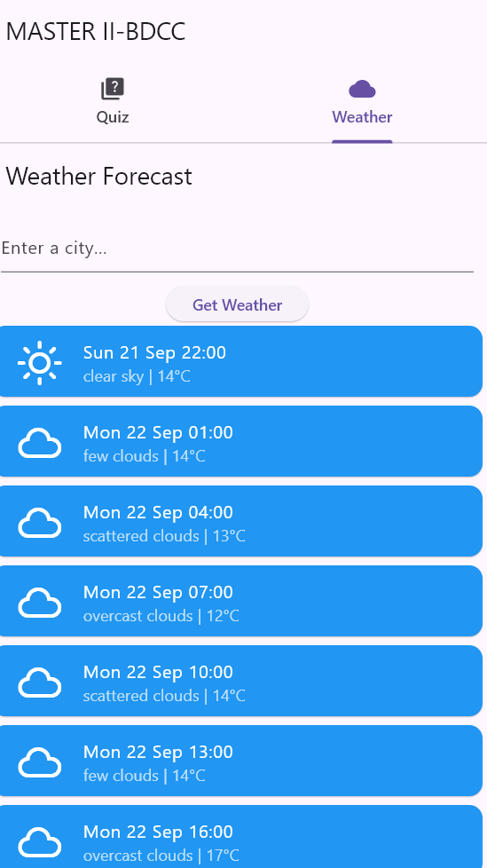
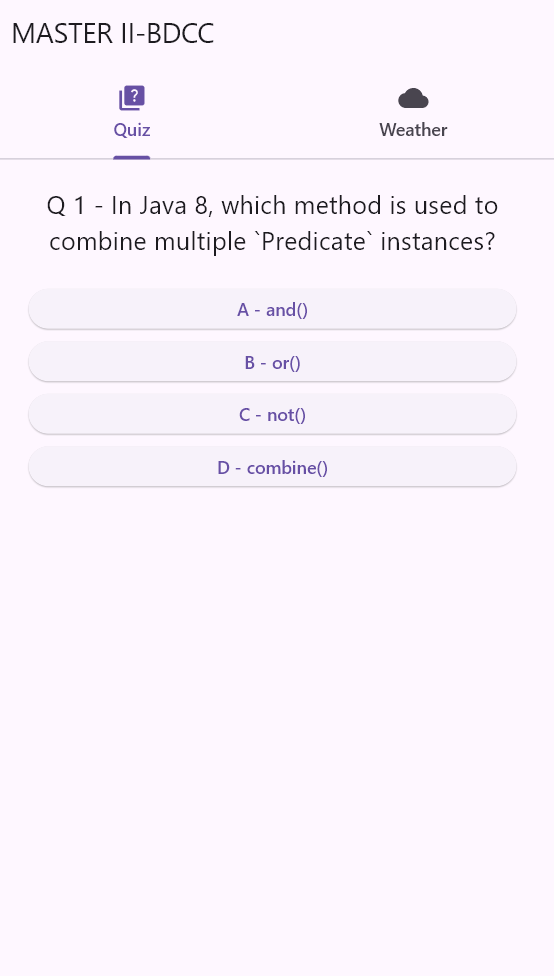

# Flutter Quiz & Weather App

Une application Flutter simple et pédagogique qui combine :
- un quiz interactif avec score dynamique
- une météo à jour via l'API OpenWeatherMap

---

## Aperçu des fonctionnalités

### Onglet Quiz
- Questions à choix multiple
- Calcul du score
- Possibilité de redémarrer le quiz

### Onglet Météo
- Recherche météo par nom de ville
- Affichage des prévisions (température, description, icône)
- Utilisation de l'API [OpenWeatherMap](https://openweathermap.org/api)

---

## Technologies utilisées

| Fonction           | Techno              |
|--------------------|---------------------|
| UI Mobile          | Flutter (Dart)      |
| API météo          | OpenWeatherMap      |
| State Management   | Stateful Widgets    |
| Données dynamiques | `http`, `intl`, `flutter_dotenv`, `weather_icons` |

---

## Aperçu de l'application

|                         Weather                          |                         Question Quiz                          |                         Score Quiz                          |
|:--------------------------------------------------------:|:--------------------------------------------------------------:|:-----------------------------------------------------------:|
|  |  |  |

## Installation


1. **Clone le projet** :
   ```bash
   git clone https://github.com/Achrafans/flutter-quiz-weather
   cd flutter-quiz-weather
   flutter pub get
   ```
### Variables d'environnement

Créez un fichier `.env` à la racine du projet avec le contenu suivant :
```bash
     OPENWEATHER_API_KEY=your_api_key_here
```
   
---

Structure du projet
```
lib/
│
├── main.dart              # Point d'entrée, avec les 2 onglets
│
├── quiz/
│   ├── quiz.dart          # Composant principal du quiz
│   ├── question.dart      # Widget pour afficher une question
│   ├── answer.dart        # Widget pour afficher une réponse
│   └── score.dart         # Widget pour afficher le score
│
└── weather/
└── weather.dart       # Fonctionnalité météo complète
```